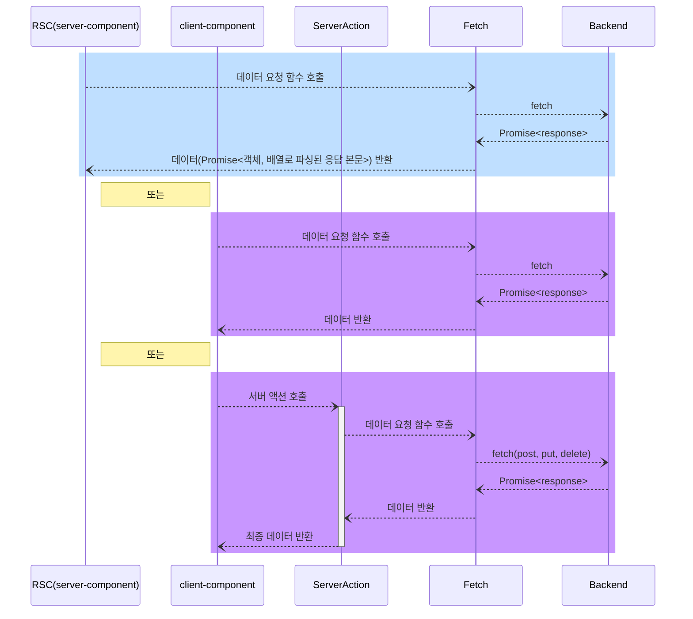

# 🌿<font color="#20604F">Greeny</font>


<br/>

## 팀 소개

|                                                   **이경민(팀장)**                                                   |                                                             **노지원**                                                              |                                                  **신민철**                                                   |
| :------------------------------------------------------------------------------------------------------------------: | :---------------------------------------------------------------------------------------------------------------------------------: | :-----------------------------------------------------------------------------------------------------------: |
|  |  |  |
|                                      [🔗 kyungmim](https://github.com/kyungmim)                                      |                                           [🔗 no-support](https://github.com/no-support)                                            |                             [🔗 shin-mincheol](https://github.com/shin-mincheol)                              |

<br/>

## 목차

<span style="font-size: 1.2em;">**1.** [ 프로젝트 설명 ](#1-프로젝트-설명)</span>  
<span style="font-size: 1.2em;">**2.** [ 기술 및 개발환경 ](#2-기술-및-개발환경)</span>  
<span style="font-size: 1.2em;">**3.** [ 핵심 기능 ](#3-핵심-기능)</span>  
<span style="font-size: 1.2em;">**4.** [ 프로젝트 구조 ](#4-프로젝트-구조)</span>  
<span style="font-size: 1.2em;">**5.** [ 역할 분담 ](#5-역할-분담)</span>  
<span style="font-size: 1.2em;">**6.** [ 플로우 차트 ](#6-플로우-차트)</span>  
<span style="font-size: 1.2em;">**7.** [ 트러블 슈팅 ](#7-트러블-슈팅)</span>  
<span style="font-size: 1.2em;">**8.** [ 리팩터링 계획 ](#8-리팩터링-계획)</span>

<br/>

## 소개 및 개요

- **프로젝트 기간** : 2024.07.29 ~ 2024.08.27
- **배포 URL** : [🌿Greeny](https://greeny.vercel.app/)
- **테스트 계정**
  ```
    ID: p1@plant.com
    PW: 11111111
  ```

📑 **프로젝트 관련 자료**
👉 🌿[피그마 시안 디자인](https://www.figma.com/design/wScllow4nEUlwP5rT813CS/Greeny?node-id=54-1972&t=oYjGGnHR8T2MGjmm-1)
👉 🌿[요구사항 명세서](https://docs.google.com/spreadsheets/d/1twNWiRhqbNU6QIXePoJyC9YdHr4K_NChuiAptxXQFPY/edit?usp=sharing)
👉 🌿[팀 노션페이지](https://meadow-hydrogen-e0d.notion.site/b0b2b9e4d430483bb1988166a86518be?pvs=4)

<br/>

## 1. 프로젝트 설명

🌿**Greeny**는 **내 식물의 성장 기록과 다른 식물의 여정을 함께하는, 식물 애호가들을 위한 소셜 네트워크**입니다.

> 식물 백과를 통해 다양한 **식물들의 키우는 방법과 정보**를 손쉽게 확인할 수 있습니다. 식물을 등록하여 여러분의 식물을 자랑해주세요. <br/> > **식물 일기**를 작성해 소중한 기억들을 기록하고, 추억들을 **다른 식집사분들과 나누어보세요.** <br/>
> 또한, 커뮤니티를 통해 **다른 식집사분들과 정보를 공유**하며 더 많은 가드닝 팁과 노하우를 얻어보세요!

<br/>

## 2. 기술 및 개발 환경

<table class="tg">
<tbody>
   <tr>
    <td class="tg-0pky">개발 환경<br></td>
    <td class="tg-0pky">[FrontEnd] Next.js, Sass<br>[BackEnd] 제공되는 API 사용 <a href='https://api.fesp.shop/apidocs/#/'>🔗 제공된 API </a></td>
  </tr>
  <tr>
    <td class="tg-0pky">버전 및 이슈 관리</td>
    <td class="tg-0pky">Git / GitHub / Notion</td>
  </tr>
  <tr>
    <td class="tg-0pky">컨벤션</td>
    <td class="tg-0pky">Eslint / Prettier / GitHub Issue, PR Template</td>
  </tr>
  <tr>
    <td class="tg-0pky">프로젝트 관리</td>
    <td class="tg-0pky">GitHub Pull Requests</td>
  </tr>
  <tr>
    <td class="tg-0pky">커뮤니케이션</td>
    <td class="tg-0pky">Notion / Discord</td>
  </tr>
  <tr>
    <td class="tg-0pky">배포</td>
    <td class="tg-0pky">Vercel</td>
  </tr>
</tbody>
</table>

<br />

### [사용한 주요 라이브러리와 사용 근거]

<table class="tg">
<tbody>
   <tr>
    <td class="tg-0pky">React Calendar / React Datepicker</td>
    <td class="tg-0pky">비동기 데이터 요청과 관리를 간단하고 효율적으로 처리하기 위해 사용</td>
  </tr>
  <tr>
    <td class="tg-0pky">React Hook Form</td>
    <td class="tg-0pky">폼 상태 관리</td>
  </tr>
    <tr>
    <td class="tg-0pky">zod</td>
    <td class="tg-0pky">데이터 유효성 검증</td>
  </tr>
  <tr>
    <td class="tg-0pky">Husky</td>
    <td class="tg-0pky">일단은 기능 구현 위주로 개발하는 것을 원칙으로 했지만, 추후 어느 정도 기능 구현이 되어 리팩터링 단계 때 테스트 코드를 작성하게 된다면, 허스키를 통해 커밋 전 테스트를 실행해볼 수 있기 때문에 사용을 고려해보다가, vercel에 배포 전 미리 빌드 테스트 또한 허스키를 사용해서 해볼 수 있어서 선정</td>
  </tr>
  <tr>
    <td class="tg-0pky">Sass</td>
    <td class="tg-0pky">css-in-js 방식과 비교해 스타일과 마크업의 분리를 통해 가독성이 좋음. 성능 또한 css-in-js 방식은 런타임에 스타일을 선택하는 반면 scss는 사전 컴파일되어 최종 css 파일로 변환되므로 브라우저의 성능 부담이 줄어듦.</td>
  </tr>
  <tr>
    <td class="tg-0pky">Swiper</td>
    <td class="tg-0pky">meta 태그와 페이지별 타이틀을 위해 사용</td>
  </tr>
  <tr>
    <td class="tg-0pky">Zustand</td>
    <td class="tg-0pky">떨어져 있는 컴포넌트 간 데이터 전달</td>
  </tr>
  <tr>
    <td class="tg-0pky">Storybook</td>
    <td class="tg-0pky">현업에서 있을 디자인 팀과의 소통을 위해 사용</td>
  </tr>
  <tr>
    <td class="tg-0pky">MSW</td>
    <td class="tg-0pky">백엔드 팀에서 API 구현 완료할 때까지 기다려야 하는 대기 시간을 줄이기 위해 API mocking library 사용</td>
  </tr>
  <tr>
    <td class="tg-0pky">Radix</td>
    <td class="tg-0pky">잘 만들어진, 커스텀한 스타일링이 가능한, 접근성이 고려된 Headless UI 컴포넌트를 통해, 클라이언트 컴포넌트로 만들지 않아도 되는 탭 컴포넌트 구현용으로 사용</td>
  </tr>
  <tr>
    <td class="tg-0pky">React-query</td>
    <td class="tg-0pky">클라이언트 컴포넌트에서 비동기 데이터 요청, 무한 스크롤, 캐시 관리용</td>
  </tr>
  <tr>
    <td class="tg-0pky">Sharp</td>
    <td class="tg-0pky">이미지 최적화용</td>
  </tr>  
</tbody>
</table>

<br />

### [데이터 처리 흐름 시퀀스 다이어그램]



## 3. 핵심 기능(반응형)

### 홈

배너, 추천 식물, 다른 식집사분들의 일기, 게시글들을 한 눈에 확인해 보세요.
나와 어울리는 식물을 MBTI 테스트를 통해 알아보는 이벤트 페이지도 있습니다.
|홈 메인|
|:-:|
||

### 식물 백과

식물 백과를 통해 다양한 식물의 정보들과 가드닝 정보를 확인할 수 있습니다.
|식물 백과|
|:-:|
||

### 마이 페이지

내 식물과 게시글들을 확인할 수 있습니다. <br/>
팔로우한 식물과 식집사를 관리할 수 있고 좋아요한 게시글들을 확인할 수 있습니다.
|팔로우한 식물 및 좋아요한 게시글 확인|식물 팔로우 취소|
|:-:|:-:|
|||

### 나의 식물

나의 식물을 등록하고 식물과 함께한 활동을 일기에 기록하고 추억할 수 있습니다. <br/>
작성된 일기는 식물 이야기에 등록되어 다른 식집사분들과 소중한 기억들을 공유할 수 있습니다.
|식물 등록|나의 식물 일기 상세|일기 작성|
|:-:|:-:|:-:|
||||

### 식물 이야기

다른 식집사분들의 활동들을 확인할 수 있고 관심있는 식물을 팔로우하여 그 식물의 성장 과정을 관찰해나갈 수 있습니다.
|일기 상세 페이지|식물 팔로우|
|:-:|:-:|
|||

커뮤니티를 통해 정보를 공유할 수 있습니다.
| 게시글 상세 페이지 | 댓글 등록/수정/삭제 | 게시글 등록/삭제 |
| :--------------------------------------------------------------------------------------------------------: | :--------------------------------------------------------------------------------------------------------: | :--------------------------------------------------------------------------------------------------------: |
|  |  |  |

<br />

## 4. 프로젝트 구조

```
📦 Greeny
├─ 📄 .env
├─ 📄 .env.local
├─ 📄 .eslintrc.json
├─ 📄 .gitignore
├─ 📄 .Prettierrc.cjs
├─ 📄 auth.d.ts
├─ 📄 env.d.ts
├─ 📄 next-env.d.ts
├─ 📄 next.config.mjs
├─ 📄 package.json
├─ 📄 README.md
├─ 📄 tsconfig.json
├─ 📄 yarn.lock
├─ 📁 .github
│  ├─ 📄 pull_request_template.md ---------- GitHub PR 템플릿
│  └─ 📁 ISSUE_TEMPLATE
│     └─ 📄 basic-issue-template.md -------- GitHub Issue 템플릿
└─ 📁 src
    ├─ 📄 auth.ts
    ├─ 📄 middleware.ts
    ├─ 📁 app
    │  ├─ 📁 (greeny)
    │  │  ├─ 📁 (home) --------------------- 홈 페이지
    │  │  ├─ 📁 books ---------------------- 식물 백과 페이지
    │  │  │  └─ 📁 [cntntsNo] -------------- 식물 백과 식물 상세 페이지
    │  │  ├─ 📁 event ---------------------- 이벤트 페이지
    │  │  ├─ 📁 plant ---------------------- 나의 식물 페이지
    │  │  │  ├─ 📁 new --------------------- 식물 등록 페이지
    │  │  │  └─ 📁 [id] -------------------- 식물 상세 페이지
    │  │  │      ├─ 📁 diaryEdit ----------- 식물 일기 페이지
    │  │  │      ├─ 📁 diaryNew ------------ 식물 일기 등록 페이지
    │  │  │      └─ 📁 edit ---------------- 식물 일기 수정 페이지
    │  │  ├─ 📁 profile -------------------- 프로필 페이지
    │  │  │  ├─ 📁 bookmark ---------------- 북마크 목록 페이지
    │  │  │  ├─ 📁 detail ------------------ 프로필 상세 페이지
    │  │  │  ├─ 📁 edit -------------------- 프로필 수정 페이지
    │  │  │  └─ 📁 [_id] ------------------- 다른 사용자 프로필 페이지
    │  │  │      ├─ 📁 plant --------------- 사용자의 식물 팔로우 페이지
    │  │  │      └─ 📁 user ---------------- 사용자의 다른 사용자 팔로우 페이지
    │  │  └─ 📁 story ---------------------- 식물 이야기 메인 페이지
    │  │      ├─ 📁 community -------------- 커뮤니티 메인 페이지
    │  │      │  ├─ 📁 new ----------------- 커뮤니티 게시글 등록 페이지
    │  │      │  └─ 📁 [id] ---------------- 커뮤니티 게시글 상세 페이지
    │  │      │      └─ 📁 edit ------------ 커뮤니티 게시글 수정 페이지
    │  │      └─ 📁 diaries ---------------- 식물 일기 메인 페이지
    │  │          └─ 📁 [id] --------------- 식물 일기 상세 페이지
    │  ├─ 📁 (user)
    │  │  ├─ 📁 login ---------------------- 로그인 페이지
    │  │  └─ 📁 signup --------------------- 회원가입 페이지
    │  ├─ 📁 api
    │  │  ├─ 📁 actions -------------------- 서버 액션 함수
    │  │  ├─ 📁 auth ----------------------- auth 관련
    │  │  └─ 📁 fetch ---------------------- fetch 함수
    │  └─ 📁 data -------------------------- 식물 정보 데이터
    ├─ 📁 components ----------------------- 컴포넌트
    ├─ 📁 hooks ---------------------------- 커스텀 훅
    ├─ 📁 styles --------------------------- CSS 초기화
    ├─ 📁 types ---------------------------- typescript 타입
    └─ 📁 utils ---------------------------- 유틸 함수
```

## 5. 역할 분담


## 6. 플로우 차트


<br/>

## 8. 깨달은 것

- 페이지별로 역할 분배함으로 인해 비슷한 컴포넌트를 여럿 만듦으로써 나중으로 갈수록 재사용성과 생산성 낮아짐
- scss 사용 경험 회고: 손이 많이 가며, 변수명 짓기 힘듦. 더 나중에 나온 ui 라이브러리(headless ui 라이브러리라던지, tailwindcss라던지...)를 사용하는 게 작은 프로젝트 시 생산성 측면에서 나을 듯.
- 기획, 디자인을 직접 만들고, 백엔드는 구현 진행 중인 상황에서 개발을 한 후기: 프론트엔드는 기획, 디자인, 백엔드 팀과 소통이 중요하며 이들간의 소통에 병목이 없어야 빠른 개발을 할 수 있음(스토리북, MSW 라이브러리를 사용하게 된 계기가 됨)
- 프론트엔드 개발자가 여럿일 때, 적어도 초기 역할 분배는 페이지별이 아닌, 소통 파트별이 나을 듯(ex. 각각 프론트-디자인 팀 간 협업을 위해 컴포넌트 디자인, 프론트-백엔드 팀 간 협업을 위해 api mock data 생성 및 타입 설계, 프론트-기획 팀 간 협업을 위해 페이지 설계 E2E 테스트 코드 생성)
