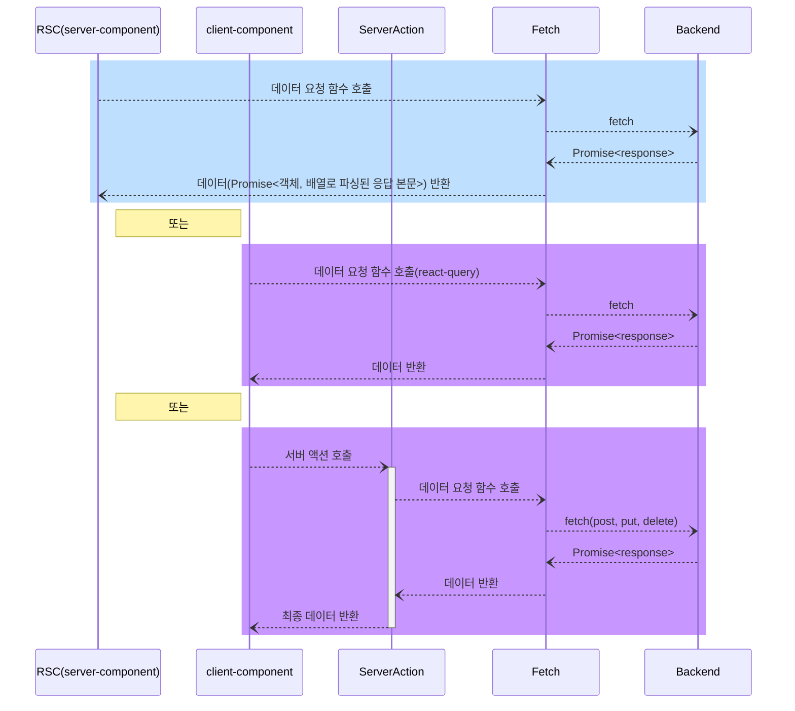

# 🌿<font color="#20604F">Greeny</font>


<br/>

## 팀 소개

|                                                   **이경민(팀장)**                                                   |                                                             **노지원**                                                              |                                                  **신민철**                                                   |
| :------------------------------------------------------------------------------------------------------------------: | :---------------------------------------------------------------------------------------------------------------------------------: | :-----------------------------------------------------------------------------------------------------------: |
|  |  |  |
|                                      [🔗 kyungmim](https://github.com/kyungmim)                                      |                                           [🔗 no-support](https://github.com/no-support)                                            |                             [🔗 shin-mincheol](https://github.com/shin-mincheol)                              |

<br/>

## 목차

<span style="font-size: 1.2em;">**1.** [ 프로젝트 설명 ](#1-프로젝트-설명)</span>  
<span style="font-size: 1.2em;">**2.** [ 기술 및 개발환경 ](#2-기술-및-개발환경)</span>  
<span style="font-size: 1.2em;">**3.** [ 핵심 기능 ](#3-핵심-기능)</span>  
<span style="font-size: 1.2em;">**4.** [ 프로젝트 구조 ](#4-프로젝트-구조)</span>  
<span style="font-size: 1.2em;">**5.** [ 역할 분담 ](#5-역할-분담)</span>  
<span style="font-size: 1.2em;">**6.** [ 플로우 차트 ](#6-플로우-차트)</span>  
<span style="font-size: 1.2em;">**7.** [ 트러블 슈팅 ](#7-트러블-슈팅)</span>  
<span style="font-size: 1.2em;">**8.** [ 리팩터링 계획 ](#8-리팩터링-계획)</span>

<br/>

## 소개 및 개요

- **프로젝트 기간** : 2024.07.29 ~ 2024.08.27
- **배포 URL** : [🌿Greeny](https://greeny-mu.vercel.app/) 혹은 깃허브 About Website
- **테스트 계정**
  ```
    ID: p1@plant.com
    PW: 11111111
  ```

📑 **프로젝트 관련 자료**
👉 🌿[피그마 시안 디자인](https://www.figma.com/design/wScllow4nEUlwP5rT813CS/Greeny?node-id=54-1972&t=oYjGGnHR8T2MGjmm-1)
👉 🌿[요구사항 명세서](https://docs.google.com/spreadsheets/d/1twNWiRhqbNU6QIXePoJyC9YdHr4K_NChuiAptxXQFPY/edit?usp=sharing)
👉 🌿[팀 노션페이지](https://meadow-hydrogen-e0d.notion.site/b0b2b9e4d430483bb1988166a86518be?pvs=4)

<br/>

## 1. 프로젝트 설명

🌿**Greeny**는 **내 식물의 성장 기록과 다른 식물의 여정을 함께하는, 식물 애호가들을 위한 소셜 네트워크**입니다.

> 식물 백과를 통해 다양한 **식물들의 키우는 방법과 정보**를 손쉽게 확인할 수 있습니다. 식물을 등록하여 여러분의 식물을 자랑해주세요. <br/> > **식물 일기**를 작성해 소중한 기억들을 기록하고, 추억들을 **다른 식집사분들과 나누어보세요.** <br/>
> 또한, 커뮤니티를 통해 **다른 식집사분들과 정보를 공유**하며 더 많은 가드닝 팁과 노하우를 얻어보세요!

<br/>

## 2. 기술 및 개발 환경

<table class="tg">
<tbody>
   <tr>
    <td class="tg-0pky">개발 환경<br></td>
    <td class="tg-0pky">[FrontEnd] Next.js, Sass<br>[BackEnd] 제공되는 API 사용 <a href='https://api.fesp.shop/apidocs/#/'>🔗 제공된 API </a></td>
  </tr>
  <tr>
    <td class="tg-0pky">버전 및 이슈 관리</td>
    <td class="tg-0pky">Git / GitHub / Notion</td>
  </tr>
  <tr>
    <td class="tg-0pky">컨벤션</td>
    <td class="tg-0pky">Eslint / Prettier / GitHub Issue, PR Template</td>
  </tr>
  <tr>
    <td class="tg-0pky">프로젝트 관리</td>
    <td class="tg-0pky">GitHub Pull Requests</td>
  </tr>
  <tr>
    <td class="tg-0pky">커뮤니케이션</td>
    <td class="tg-0pky">Notion / Discord</td>
  </tr>
  <tr>
    <td class="tg-0pky">배포 환경</td>
    <td class="tg-0pky">VERCEL, AWS ECR&ECS(Fargate) - AWS 서버는 트러블 슈팅 중으로 불안정할 수 있음</td>
  </tr>
</tbody>
</table>

<br />

### [사용한 주요 라이브러리와 사용 근거]

<table class="tg">
<tbody>
   <tr>
    <td class="tg-0pky">React Calendar / React Datepicker</td>
    <td class="tg-0pky">비동기 데이터 요청과 관리를 간단하고 효율적으로 처리하기 위해 사용</td>
  </tr>
  <tr>
    <td class="tg-0pky">React Hook Form</td>
    <td class="tg-0pky">폼 상태 관리</td>
  </tr>
    <tr>
    <td class="tg-0pky">zod</td>
    <td class="tg-0pky">데이터 유효성 검증</td>
  </tr>
  <tr>
    <td class="tg-0pky">Husky</td>
    <td class="tg-0pky">커밋 전 eslint 수행 및 깃허브에 push 전 test&build 성공을 보장 받는 용도로 사용</td>
  </tr>
  <tr>
    <td class="tg-0pky">Sass</td>
    <td class="tg-0pky">css-in-js 방식과 비교해 스타일과 마크업의 분리를 통해 가독성이 좋음. 성능 또한 css-in-js 방식은 런타임에 스타일을 선택하는 반면 scss는 사전 컴파일되어 최종 css 파일로 변환되므로 브라우저의 성능 부담이 줄어듦.</td>
  </tr>
  <tr>
    <td class="tg-0pky">Swiper</td>
    <td class="tg-0pky">meta 태그와 페이지별 타이틀을 위해 사용</td>
  </tr>
  <tr>
    <td class="tg-0pky">Zustand</td>
    <td class="tg-0pky">떨어져 있는 컴포넌트 간 데이터 구독과 관리용</td>
  </tr>
  <tr>
    <td class="tg-0pky">Storybook</td>
    <td class="tg-0pky">현업에서 있을 디자인 팀과의 소통을 위해 사용</td>
  </tr>
  <tr>
    <td class="tg-0pky">MSW</td>
    <td class="tg-0pky">백엔드 팀에서 API 구현 완료할 때까지 기다려야 하는 대기 시간을 줄이기 위해 API mocking library 사용</td>
  </tr>
  <tr>
    <td class="tg-0pky">Radix</td>
    <td class="tg-0pky">잘 만들어진, 커스텀한 스타일링이 가능한, 접근성이 고려된 Headless UI 컴포넌트를 통해, 클라이언트 컴포넌트로 만들지 않아도 되는 탭 컴포넌트 구현용으로 사용. 이후 개발 환경 시 사용 경험이 좋아 식물 백과에서 검색 조건 필터링할 때 Modal 컴포넌트도 가져다 사용 중</td>
  </tr>
  <tr>
    <td class="tg-0pky">React-Query</td>
    <td class="tg-0pky">클라이언트 컴포넌트에서 비동기 데이터 요청, 무한 스크롤, 캐시 관리용</td>
  </tr>
  <tr>
    <td class="tg-0pky">Sharp</td>
    <td class="tg-0pky">이미지 최적화용</td>
  </tr>  
  <tr>
    <td class="tg-0pky">Storybook</td>
    <td class="tg-0pky">기획 및 디자인부터 직접 구현해보는 이번 프로젝트를 하면서, 프론트엔드 개발은 기획/디자인/백엔드 팀으로부터 실시간으로 요구 사항 및 기능 변경 사항이 있어 해당 팀과 소통할 일이 잦다는 것을 깨닫고 디자인 팀과의 소통 도구인 Storybook의 필요성을 체감하게 되어 사용</td>
  </tr>  
  <tr>
    <td class="tg-0pky">MSW</td>
    <td class="tg-0pky">위와 비슷한 이유로 기획 및 백엔드에서 설계한 api 엔드포인트에 대한 응답 기능 구현이 될 때까지 대기하는 시간을 줄이기 위해 사용</td>
  </tr>  
  <tr>
    <td class="tg-0pky">Jest</td>
    <td class="tg-0pky">프론트엔드 자체의 테스트 주도 개발을 위해 짧게 사용해봄(빌드 전에 테스트 코드를 수행하는 환경 구성용으로 버튼 컴포넌트에만 적용한 상태).</td>
  </tr>
  <tr>
    <td class="tg-0pky">lodash.isequal</td>
    <td class="tg-0pky">캐싱된 데이터가 있을 경우 이를 먼저 반환하고, 이후 fetch된 데이터와 캐싱된 데이터를 비교함. </br>이때, 객체의 깊은 비교를 위해 lodash.isequal 라이브러리를 사용하여 차이가 있는 경우 새 데이터를 반환</td>
  </tr>
</tbody>
</table>

<br />

### [배포 아키텍처]

### [데이터 처리 흐름 시퀀스 다이어그램]



## 3. 핵심 기능(반응형)

### 홈

배너, 추천 식물, 다른 식집사분들의 일기, 게시글들을 한 눈에 확인해 보세요.
나와 어울리는 식물을 MBTI 테스트를 통해 알아보는 이벤트 페이지도 있습니다.
|홈 메인|식집사 테스트|
|:-:|:-:|
|||

|                                                     웹                                                     |
| :--------------------------------------------------------------------------------------------------------: |
|  |

### 식물 백과

식물 백과를 통해 다양한 식물의 정보들과 가드닝 정보를 확인할 수 있습니다.
|식물 백과|웹|
|:-:|:-:|
|||

### 마이 페이지

내 식물과 게시글들을 확인할 수 있습니다. <br/>
관찰중인 식물과 식집사를 관리할 수 있고 좋아요한 게시글들을 확인할 수 있습니다.
|관찰중인 식물,<br/> 좋아요한 게시글|관찰 식물 관리|
|:-:|:-:|
|||

|                                                     웹                                                     |
| :--------------------------------------------------------------------------------------------------------: |
|  |

### 나의 식물

내가 키우는 식물을 등록하고, 식물과 함께한 활동을 일기로 남겨 추억할 수 있습니다. <br/>
작성된 일기는 식물 이야기로 공유되어 소중한 기억을 나눌 수 있습니다.
|식물 등록|식물 정보/일기|일기 작성|
|:-:|:-:|:-:|
||||

|                                                     웹                                                     |
| :--------------------------------------------------------------------------------------------------------: |
|  |

### 식물 이야기

다른 식집사분들의 활동들을 확인할 수 있고, 관심있는 식물을 팔로우하여 그 식물의 성장 과정을 관찰해나갈 수 있습니다.
|일기 메인/상세 페이지|식물 관찰하기|
|:-:|:-:|
|||

|                                                     웹                                                     |
| :--------------------------------------------------------------------------------------------------------: |
|  |

커뮤니티를 통해 다른 식집사분들과 소통하고 정보를 공유할 수 있습니다.
| 게시글 상세 페이지 | 게시글 등록 | 게시글 수정/삭제 |
| :--------------------------------------------------------------------------------------------------------: | :--------------------------------------------------------------------------------------------------------: | :--------------------------------------------------------------------------------------------------------: |
|  |  |  |

|                                            댓글 등록/수정/삭제                                             |                                                     웹                                                     |
| :--------------------------------------------------------------------------------------------------------: | :--------------------------------------------------------------------------------------------------------: |
|  |  |

<br />

## 4. 역할 분담


## 5. 플로우 차트


<br/>

## 6. 스토리북 서버 구동 화면

|                                                 버튼                                                 |
| :--------------------------------------------------------------------------------------------------: |
|  |

|                                  헤딩, 인풋, 스켈레톤, 스피너, 탭                                  |
| :------------------------------------------------------------------------------------------------: |
|  |

|                                     푸터(로그인, 로그아웃 상태)                                      |
| :--------------------------------------------------------------------------------------------------: |
|  |

## 7. MSW 서버, 클라이언트 구동 화면

|                                         식물 친구 모킹                                          |
| :---------------------------------------------------------------------------------------------: |
|  |

|                                           커뮤니티 포스트 모킹                                           |
| :------------------------------------------------------------------------------------------------------: |
|  |

## 8. 깨달은 것

- **초반 설계의 중요성에 대해 체감함.** 페이지별로 역할 분배함으로 인해 비슷한 컴포넌트를 여럿 만들고 있으며, 커스텀 훅을 각자 만든다던지 하는 식이라 현재 갈수록 재사용성과 생산성 낮아짐(현재 프로젝트에서 가장 큰 기술 부채로 생각됨. h1~h6 태그를 polymorphic 컴포넌트로 리팩토링하고 싶어 공통 컴포넌트 폴더에 Heading 컴포넌트는 만들었지만, 일일이 이미 있던 h1~h6 태그들을 이 컴포넌트로 수정할 엄두가 안 남).
- 
- 그러나 좋았던 점은 각자의 방식으로 구현한 코드를 비교하면서 좋은 코드란 어떤 것인지 생각하게 되는 계기가 됨
- scss 사용 경험 회고: 손이 많이 가며, 변수명 짓기 힘듦. 더 나중에 나온 ui 라이브러리(radix과 같은 headless ui 라이브러리라던지, tailwindcss라던지...)를 사용하는 게 작은 프로젝트 시 생산성 측면에서 나을 듯.
- scss 사용 경험 회고2: 굳이 scss를 쓸 필요가 없다. 2023년 말부터 모든 브라우저에서 css nesting을 지원한다는 것을 알게 됨.
- 기획, 디자인을 직접 만들고, 백엔드는 구현 진행 중인 상황에서 개발을 한 후기: 프론트엔드는 기획, 디자인, 백엔드 팀과 소통이 중요하며 이들간의 소통에 병목이 없어야 빠른 개발을 할 수 있음(팀 프로젝트 기간이 끝난 후 스토리북, MSW 라이브러리를 사용해보는 계기가 됨)
- 프론트엔드 개발자가 여럿일 때, 적어도 초기 역할 분배는 페이지별이 아닌, 소통 파트별이 나을 듯(ex. 각각 프론트-디자인 팀 간 협업을 위해 컴포넌트 디자인, 프론트-백엔드 팀 간 협업을 위해 api mock data 생성 및 타입 설계, 프론트-기획 팀 간 협업을 위해 페이지 설계 Cypress 모듈을 사용한 E2E 테스트 코드 생성. 다만, 작은 프로젝트에서 E2E 테스트는 코드 작성 구현에 걸리는 시간 대비 직접 테스트 해보는 게 더 코스트가 적지 않을까 생각됨)
- 캐싱할 데이터를 서버에서 관리할 것인지 혹은 클라이언트에서 리액트 쿼리로 관리를 할 것인지 그리고 어떤 네이밍으로 관리할 것인지를 미리 정하거나/규칙이 있거나/문서화라도 되어 있어야 하는 것 같다. 상태라는 것도 결국 데이터고, 데이터 공급원이 단일(Single Source Of Truth)하지 않다면 개발 복잡도를 올리는 것 같다. 이 부분에 대해 생각하다 [이 영상](https://www.youtube.com/watch?v=yl8_ZRDA5pw&t=3s)이 떠올랐다. 인간은 두뇌 구조상 멀티 스레드적 사고를 잘 하지 못 하며, 멀티 스레드를 잘 다루는 방법은 싱글 스레드부터 잘 다루는 것이라는 영상인데, 내게는 최대한 우선 싱글 스레드로 만드는 게 좋다는 것처럼 느껴졌다. 프론트엔드의 캐시 상태 관리도 비슷하지 않을까 싶었다.
- 타입스크립트에 대한 깊이 있는 이해가 중요하다. 전에는 나의 북마크 목록을 조회할 때 북마크 타입별(user, product, post)로 여러 개의 fetch 함수를 만들었던 것을 하나의 함수(getMyBookmarks)로 리팩토링하는 경험이 짜릿했다. 그리고 초반 타입 설계 시 interface를 선택했는데, type이 제공하는 다양한 기능을 을 생각하면 type을 선택하는 것이 더 낫지 않았을까 싶다.
- 배포 경험 회고: 어느 환경에서든 동일한 결과를 보장받기 위해 도커 기술이 사용된 ECR, ECS, Fargate 구성으로 가져갔는데, 비용이 예상했던 것보다 훨씬 많이 나가고 있다. 어느 환경에서든 동일한 결과를 보장받기 위한 기술 스택으로 ECR, ECS, Fargate를 가져가는 것은 과하지 않나 싶다. 목표가 어느 환경에서든 동일한 결과를 보장받기 위함이었다면 yarn berry를 사용하는 것이 낫겠다 싶다. 아래는 단 한 차례 ECR에 업로드하여 약 이틀 동안 배포되어 운영했을 때 AWS 비용임(public, private subnet을 각 가용 영역마다 한 개씩 만들어 도커 컨테이너는 private subnet에 두고, 서비스 및 로드 밸런싱을 위해 ALB를 붙였을 때의 상황. 아무리 그래도 나름 절약하겠다고 Nat gateway를 하나만 쓰는 식으로 나름 비용을 절약해보려 한 건데 생각보다 많이 나와서 놀랐다.) 
- 배포 경험 회고2: 심지어 개발 환경이나 vercel에 배포했을 때와 다르게 동작한다. 다르게 동작하는 게 아니라 환경 변수를 잘 읽어오질 않아 기능 장애를 유발 중이다. 이 책임이 Next.js쪽 버그인지 하여튼 원인을 더 알아봐야겠지만, Next.js를 배포하기에 가장 좋은 환경은 그냥 Vercel에 올리는 것 같다.

## 9. 트러블 슈팅 로그

- 백엔드 api mocking을 위한 msw 설정 시, 클라이언트 사이드 요청만 인터셉트되고 서버사이드 엔드포인트는 인터셉트해서 가짜 json데이터를 보내주지 못하는 이슈 - next.js의 신규 버전에서 실험적으로 지원하는 설정 구성을 사용해 해결. [참고](https://github.com/mswjs/msw/issues/1644)
  - 구체적 방법: next.config.mjs에서 instrumentationHook 조건을 true로 설정 및 root 경로에 src/instrumentation.ts 파일 설정
